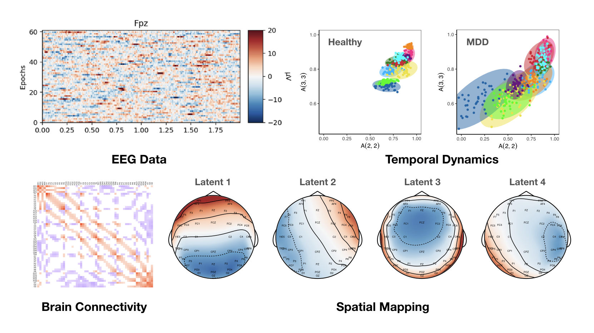

# RESSM-EEG

R code for the analysis from the paper "A Hierarchical Random Effects State-space Model for Modeling Brain Activities from Electroencephalogram Data" by Xingche Guo, Bin Yang, Ji Meng Loh, Qinxia Wang, and Yuanjia Wang

## Overview

### gener_EEG_funcs.R
R function for generating EEG signals for one group (n subjects, J time-segments, P EEG channels, Q EEG latent channels).

### example_run.R
A simple R demo showing how to simulate EEG signals, and run MCMC algorithm of the proposed RESSM method.

### data_analysis
The folder *"data_analysis"* contains files for extracting EEG features (i.e. temporal dynamics and spatial mappings), they also reproduce Figures 2-5 in the paper. 
* **visualize_Ar.R** R file to reproduce Figure 2 (i.e., group-level A).
* **topo_theta.R** R file to reproduce Figure 3 (i.e., group-level theta).
* **directional_connectivity.R** R file to reproduce Figure 4 (i.e., group-level directional connectivity).
* **visualize_Ari.R** R file to reproduce Figure 5 (i.e., subject- and segment-level A).
* **MCMC_samples.rds** RData for the MCMC outputs (note that only necessary parts for reproducing the results are saved to keep this file less than 25MB, a complete output is expected to be larger than 1GB).

### algo_init
The folder *"algo_init"* contains functions dedicated to the initialization step of the MCMC algorithm. These functions aim to generate effective initial values for the temporal dynamical and spatial mapping matrices, ensuring a robust starting point for the MCMC iterations.

### algo_mcmc_sign
The folder *"algo_mcmc_sign"* contains functions used for our proposed MCMC algorithm. 
* **algo_mcmc_sign/mcmc_main.R** Main R function for the proposed MCMC algorithm.
* **algo_mcmc_sign/mcmc_one_iter.R** R function for one iteration in the proposed MCMC algorithm.
* **algo_mcmc_sign/mcmc_A.R** R function for the full conditional posteriors of the temporal dynamical matrices.
* **algo_mcmc_sign/mcmc_T.R** R function for the full conditional posteriors of the spatial mapping matrices.
* **algo_mcmc_sign/mcmc_M.R** R function for the full conditional posteriors of the latent EEG signals.
* **algo_mcmc_sign/mcmc_S.R** R function for the full conditional posteriors of the variance components.
* **algo_mcmc_sign/rcnorm.R** R function for simulating canonical multivariate Gaussian distributions.

